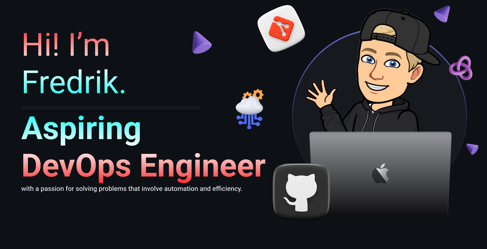

<h2 align="center"><b>I love connecting with different people</b> so if you want to say <b>hi, I'll be happy to meet you!</b> 😊</h2>

<p align="center">
  
  <a href="https://linkedin.com/in/fredrik-m/">
    
  </a>
  <a href="https://fredrikm.dev">
    
  </a>
  <a href="mailto:fredrikmagnusson3@gmail.com">
    
  </a>
  <a href="https://discordapp.com/users/225341664787562496">
    
  </a>
</p>

<p align="center">
  <a href="https://github.com/mindriddler">
    
  </a>
  
</p>
<hr>

<div align="center">
    <h3>
        <a href="https://emoji.gg/emoji/SpotifyLogo">
            
        </a>
        Currently Playing
    </h3>
    <a href="https://open.spotify.com/playlist/62RKQoCghY0ZJ4hK3Tmq9c?si=6a9b1c5833734776">
        
    </a>
</div>
<hr>

<h1 align="center">💻 Tech Stack</h1>
<h2 align="center">⭐ Favorites</h2>
<p align="center">
  
  
  
  
  
  
  
  
  
  
</p>

<details>
  <summary><h3>🛠 A few more</h3></summary>
  
  <p align="center">
    
    
    
    
    
    
    
    
    
    
  </p>
  <hr>
</details>
<details>
  <summary><h3>📜 My certifications</h3></summary>
  
  + [**Terraform Associate** (August 2023)](https://www.credly.com/badges/e2eb1846-4eb6-4d2d-ab6c-69b677d0f57e)
<hr>
</details>

<h1 align="center">💻 Recent activity</h1>
<!-- <div align="center">
  <table width="100%">
    <tr>
        <td>
          
        </td>
    </tr>
  </table>
</div> -->

<table width="100%">
    <tr>
        <td>
            
            
        </td>
    </tr>
</table>
<hr>

<details>
  <summary><h3>🛢️ Some data</h3></summary>
  <table align="center" width="100%">
    <tr>
      <td>
        
      </td>
    </tr>
  </table>

  <!--START_SECTION:waka-->
**I'm a Night 🦉** 

```text
🌞 Morning                36 commits          █░░░░░░░░░░░░░░░░░░░░░░░░   03.60 % 
🌆 Daytime                418 commits         ██████████░░░░░░░░░░░░░░░   41.80 % 
🌃 Evening                333 commits         ████████░░░░░░░░░░░░░░░░░   33.30 % 
🌙 Night                  213 commits         █████░░░░░░░░░░░░░░░░░░░░   21.30 % 
```
📅 **I'm Most Productive on Wednesday** 

```text
Monday                   164 commits         ████░░░░░░░░░░░░░░░░░░░░░   16.40 % 
Tuesday                  155 commits         ████░░░░░░░░░░░░░░░░░░░░░   15.50 % 
Wednesday                208 commits         █████░░░░░░░░░░░░░░░░░░░░   20.80 % 
Thursday                 54 commits          █░░░░░░░░░░░░░░░░░░░░░░░░   05.40 % 
Friday                   89 commits          ██░░░░░░░░░░░░░░░░░░░░░░░   08.90 % 
Saturday                 186 commits         █████░░░░░░░░░░░░░░░░░░░░   18.60 % 
Sunday                   144 commits         ████░░░░░░░░░░░░░░░░░░░░░   14.40 % 
```


📊 **This Week I Spent My Time On** 

```text
🕑︎ Time Zone: Europe/Stockholm

💬 Programming Languages: 
JavaScript               15 hrs 20 mins      ████████████████████░░░░░   78.76 % 
YAML                     1 hr                █░░░░░░░░░░░░░░░░░░░░░░░░   05.14 % 
Python                   42 mins             █░░░░░░░░░░░░░░░░░░░░░░░░   03.61 % 
XML                      40 mins             █░░░░░░░░░░░░░░░░░░░░░░░░   03.48 % 
Markdown                 38 mins             █░░░░░░░░░░░░░░░░░░░░░░░░   03.30 % 

🔥 Editors: 
VS Code                  19 hrs 28 mins      █████████████████████████   100.00 % 

🐱‍💻 Projects: 
portfolio                16 hrs 35 mins      █████████████████████░░░░   85.20 % 
test                     59 mins             █░░░░░░░░░░░░░░░░░░░░░░░░   05.07 % 
expense-tracker          32 mins             █░░░░░░░░░░░░░░░░░░░░░░░░   02.82 % 
terraform_ansible_pipelin29 mins             █░░░░░░░░░░░░░░░░░░░░░░░░   02.56 % 
mindriddler              21 mins             ░░░░░░░░░░░░░░░░░░░░░░░░░   01.85 % 
```

**I Mostly Code in Python** 

```text
Python                   6 repos             ██████████████░░░░░░░░░░░   54.55 % 
JavaScript               3 repos             ███████░░░░░░░░░░░░░░░░░░   27.27 % 
HCL                      1 repo              ██░░░░░░░░░░░░░░░░░░░░░░░   09.09 % 
PHP                      1 repo              ██░░░░░░░░░░░░░░░░░░░░░░░   09.09 % 
```


 Last Updated on 21/09/2023 22:09:38 UTC
<!--END_SECTION:waka-->
</details>

---

DISCLAIMER: Top languages does not indicate my skill level or anything like that. It is just a metric of which languages have been hosted by me on GitHub based on the usage across repositories. There are others which I haven't put up on GitHub.
